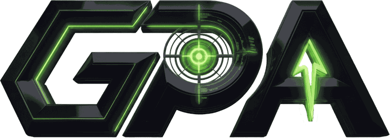

<p align="center"></p>

# GamePoint — Screen-Vision AI Game Coaching

**Real-time, compliance-first coaching for PC games.** GamePoint watches your screen — never the game's memory — and answers one hotkey press with one schema-validated piece of advice, delivered to a desktop overlay over a private realtime channel.

Owner: **APEX Business Systems LTD** (Edmonton, AB) · Domain: **[gamepointagent.com](https://gamepointagent.com)** · Status: **v0.1.x pre-release** — backend loop deployed and live-verified.

---

## Non-negotiable invariants

These are enforced structurally (CI gates, SQL constraints, Zod contracts) — not by convention:

1. **Screen-vision only.** DXGI Desktop Duplication (OS-level GPU texture readback on hotkey). No game-memory reads, no injection, no DLLs, no packet hooks — the capture service never touches game processes.
2. **No audio capture.** `audio_opus_bytes` is structurally `null` in the wire contract; the compliance gate bans audio-capture APIs repo-wide.
3. **Frame-only v1.** One user-triggered frame/ROI per hotkey press. No continuous video (ADR-003).
4. **Local-only overlay.** Frames go from the Windows service to Supabase Edge — never through Cloudflare, never stored (ADR-001).
5. **Supabase is the sole backend authority** — auth, Postgres+RLS, Edge Functions, Realtime, telemetry. Cloudflare serves static assets only (ADR-005).
6. **Deny-by-default title support.** A game is coachable only if `governance/compliance-matrix.md` marks it cleared + runtime-eligible with commercially licensed knowledge sources — enforced in SQL (006), not app code.
7. **Advantage Check.** Coaching never calls out live opponent information you could not perceive yourself — enforced as a prompt constraint and a post-filter, with PvP-flagged titles hardened further.
8. **Truth bar.** Every coaching claim carries evidence ids or is explicitly marked `not_verified` — a database CHECK constraint, not a style guide.
9. **Assist budgets are circuit breakers**, not targets: 1200 in / 120 out tokens, ≤786,432 px, ≤2 ROIs, 1500 ms, 500 µ$ (ADR-004).
10. **Secrets never reach the browser.** Only `VITE_`-prefixed publishable values enter the bundle; model keys and service-role live in Supabase Edge secrets only.

## Architecture

```
apps/web ───────────── React/Vite marketing + authenticated product plane → Cloudflare Workers (static assets + canonical-host worker)
apps/overlay ───────── Windows coaching overlay UI (local; binds to a web-issued SessionConfig, ADR-008)
services/capture-win ─ Rust: DXGI capture, ROI heuristics, JPEG encode, HTTPS dispatch, offline queue (ADR-006)
packages/contracts ─── Zod single source of truth (ADR-007) → synced to Edge, mirrored in Rust serde (fixture-parity CI)
packages/router ────── Assist budgets, prompt builder, cascade + Advantage Check (node-tested, synced to Edge)
packages/ingest ────── Python: licensed-source ingestion; license_enforcer quarantines non-commercial sources
supabase/ ──────────── Migrations (001–008), Edge Functions (assist · ingest-webhook · retrieval-plan), RLS tests
workers/ ───────────── Cloudflare canonical-host redirect worker (wrangler.jsonc)
governance/ ────────── compliance-matrix.md + CI gates (compliance, license)
```

**The coaching loop (deployed, live-verified 2026-07-09):** hotkey → foreground probe → DXGI frame → JPEG → `AssistRequest` (Zod) → Edge `assist`: JWT → session ownership → per-user rate limit → title gate (SQL) → retrieval → **hybrid model cascade** → Advantage Check → `coaching_responses` insert → Realtime broadcast on private `session:{id}` → overlay HUD. Every hop carries a `request_id` (ADR-008).

**Hybrid intelligence (ADR-009 — Groq & Gemini Only):** provider-prefixed model aliases (`groq:` / `gemini:`) with cross-provider failover and an adaptive health circuit — a provider that hard-fails is cooled down and skipped instantly, then auto-retried (`ASSIST_ESCALATION_ALLOWED=true`). Primary: Groq Llama 4 Scout (`GROQ_API_KEY`) · Fallback: Gemini Flash Lite (`GEMINI_API_KEY`). **OpenAI strictly excluded**: `EMBEDDINGS_PROVIDER_ORDER=gemini` ensures retrieval embeddings (`gemini-embedding-001`, 1536-dim) never fall back to legacy OpenAI endpoints.

## Quickstart

```bash
pnpm install --frozen-lockfile
pnpm lint        # compliance gate + license gate
pnpm typecheck   # tsc -b: web, overlay, contracts, router
pnpm test        # node --test: contracts, router, overlay
pnpm --filter web test && pnpm --filter web build
pnpm --filter overlay build
pnpm --filter web e2e   # Playwright (build + preview)
```

Rust service: `cd services/capture-win && cargo clippy --all-targets -- -D warnings && cargo test`.
Ingest: `cd packages/ingest && PYTHONPATH=. pytest -q`.
Edge functions: `cd supabase/functions && deno check assist/index.ts …` (CI job `edge-typecheck`).

Copy `ENV.example` for the full variable reference. Browser build vars (`VITE_SUPABASE_URL`, `VITE_SUPABASE_PUBLISHABLE_KEY`) must be set under **Cloudflare Workers Builds → Build environment variables** so they are compiled by Vite; model keys (`GROQ_API_KEY`, `GEMINI_API_KEY`) are Supabase Edge secrets **only**.

## CI (every PR / push to main)

`compliance-gate` → `license-gate` → contracts sync check → typecheck → unit tests → web build → overlay build, plus parallel jobs: **rust** (clippy/test/win-target check + fixture parity), **ingest** (pytest), **edge-typecheck** (deno), **security** (gitleaks + cargo-audit), **browser-e2e** (Playwright), **smoke** (production route checks).

## Documentation map

| Where | What |
|---|---|
| `.understand-anything/` | Canonical behavior rules, architecture, environment, ADR index — read first |
| `docs/adr/` | ADR-001 … ADR-009 (decisions with consequences) |
| `governance/compliance-matrix.md` | Per-title legal/compliance verdicts — the gate of record |
| `docs/evidence/` | Verification evidence per work package (commands, results, live proofs) |
| `docs/runbooks/` | Cloudflare + Supabase deploy runbooks |
| `memory/omni-recall/` | Durable agent memory & session continuity |

## Compliance posture

Compliance verdicts in this repo are research findings, not legal advice. Kernel-anticheat titles ship with mandatory false-positive-ban disclosure. GTA support is single-player scope only, pending legal review. Free-tier model providers are for development only — GA requires paid tiers with data controls and licensed legal review.

© APEX Business Systems LTD. All rights reserved.
